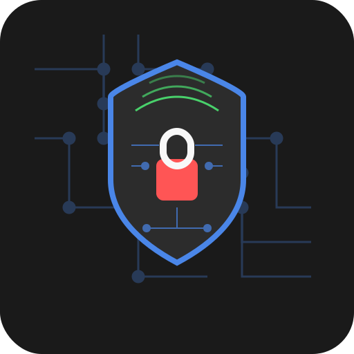

# ThingNix

[](https://opensource.org/licenses/MIT)
[](https://nixos.org)
[](https://www.oshwa.org)
[](https://github.com/HexGuard-Security/ThingNix/releases)
[](https://github.com/HexGuard-Security)
[]()

A reproducible NixOS-based operating system for IoT penetration testing and hardware hacking.

<div align="left">
  
  
  
  
</div>

> **PRE-RELEASE STATUS**: ThingNix is currently in alpha development stage. We're actively looking for testers to help identify issues and provide feedback. See the [Testing](#become-a-tester) section to get involved!

## Overview

ThingNix is a specialized NixOS distribution designed for security researchers, penetration testers, and hobbyists who work with Internet of Things (IoT) devices, embedded systems, and RF communications. It provides a declarative, reproducible environment with pre-configured tools for firmware analysis, radio frequency investigation, and hardware exploitation.

Part of the future "NixCraft" series for specialized pentesting domains.

## Key Features

- **Reproducible Environments**: Built on NixOS with Nix Flakes for consistent, declarative configurations
- **Atomic Updates**: Safe system upgrades with rollback capability
- **Pre-configured Hardware Support**: Ready-to-use drivers and udev rules for common pentesting hardware
- **Specialized Tooling**: Curated collection of tools for IoT security research
- **Community-Driven**: Open to contributions and tool suggestions

## Tool Categories

### Firmware Analysis
<div align="left">
  
  
  
</div>

- Binwalk
- Ghidra
- Radare2
- OpenOCD
- Flashrom

### RF/SDR
<div align="left">
  
  
</div>

- RTL-SDR
- GNURadio
- GQRX
- Inspectrum
- Universal Radio Hacker (URH)
- Multimon-NG

### Zigbee/BLE
- KillerBee
- Bleah
- Crackle
- BTLEJack

### Network/Exploitation
<div align="left">
  
  
  
</div>

- Nmap
- Metasploit
- Bettercap
- RouterSploit
- Expliot

### Utilities
<div align="left">
  
  
  
</div>

- Python3
- Wireshark
- QEMU
- Sigrok

## Getting Started

### Quick Start

To build and use ThingNix:

1. Clone the repository:
   ```bash
   git clone https://github.com/HexGuard-Security/ThingNix.git
   cd ThingNix
   ```

2. Build the ISO using the build script:
   ```bash
   ./build.sh
   ```

3. Flash the ISO to a USB drive:
   ```bash
   sudo dd if=build/thingnix-0.1.0-alpha-x86_64_linux.iso of=/dev/sdX bs=4M status=progress
   ```

4. Boot from the USB drive and start hacking!

### System Requirements

- **Minimal**: 2GB RAM, dual-core CPU, 20GB storage
- **Recommended**: 8GB+ RAM, quad-core CPU, 50GB+ SSD, compatible SDR hardware

### Supported Architectures

- x86_64 (primary)
- aarch64 (experimental)

## Building the ISO

ThingNix uses Nix Flakes to create reproducible builds. The build process varies depending on your host system:

### On Linux

If you're running Linux, you can build ThingNix directly:

```bash
# Make sure you have Nix installed with flakes enabled
nix-shell -p nixos-generators git

# Clone and build
git clone https://github.com/HexGuard-Security/ThingNix.git
cd ThingNix
./build.sh
```

### On macOS

Building NixOS-based systems on macOS requires additional steps. We've provided detailed instructions in [docs/BUILD-ON-MAC.md](docs/BUILD-ON-MAC.md).

In short, you'll need to:
1. Set up a Linux VM or container environment
2. Build the ISO inside that environment
3. Transfer the ISO back to your host system

### On Windows

Building on Windows requires WSL2 (Windows Subsystem for Linux) with a Linux distribution that supports Nix. Follow the Linux instructions after setting up your WSL environment.

## Become a Tester

**We need your help!** ThingNix is currently in alpha and we're looking for testers to help improve it before the official release. As a tester, you'll:

- Build and try out pre-release versions of ThingNix
- Test compatibility with various hardware devices
- Report bugs and provide feedback
- Help improve documentation
- Suggest features and improvements

**To become a tester:**

1. Star and watch this repository for updates
2. Join our [Discord server](https://discord.gg/j2fFUYT8h7) to connect with other testers
3. Check the [Issues](https://github.com/HexGuard-Security/ThingNix/issues) page for known issues and testing tasks
4. Report your findings by creating new issues with the "testing" label

We particularly need testers with:
- Various SDR hardware (RTL-SDR, HackRF, etc.)
- IoT development boards
- JTAG/SWD debugging hardware
- Zigbee/BLE sniffers

## Community & Design Contributions

ThingNix features a growing collection of custom assets including icons, wallpapers, and themes:

<div align="center">
  
  
  
  
</div>

<div align="center">
  
  
</div>

<div align="center">
  
  
</div>

<div align="center">
  
</div>

### We're Looking for Design Contributors!

Are you skilled with:
- Vector graphics design (SVG)
- Inkscape or other open-source design tools
- UI/UX design for Linux environments
- GNU/Linux theming

Join our community and help shape the visual identity of ThingNix! We welcome contributions for:
- Additional wallpapers
- Tool-specific icons
- UI theme improvements
- Logo variations
- Documentation illustrations

See our [contribution guidelines](CONTRIBUTING.md) to get started or join our [Discord community](https://discord.gg/j2fFUYT8h7).

## Customization

ThingNix is designed to be easily customizable. See [CUSTOMIZATION.md](docs/CUSTOMIZATION.md) for details on how to:

- Add your own tools and packages
- Customize the desktop environment
- Configure hardware support
- Create custom modules

## Tool Inventory

ThingNix comes with a comprehensive suite of pre-installed security tools. For a complete list, see [TOOLS.md](docs/TOOLS.md).

If you need a tool that isn't included, check our documentation on [adding custom packages](docs/custom-packages.md).

## Hardware Compatibility

ThingNix is designed to work with common IoT pentesting hardware:

- SDR receivers (RTL-SDR, HackRF, etc.)
- JTAG/SWD debuggers
- Flash programmers (CH341A, etc.)
- Zigbee/BLE sniffers

See [HARDWARE.md](docs/HARDWARE.md) for detailed compatibility information.

## Building

```bash
# Clone the repository
git clone https://github.com/HexGuard-Security/ThingNix.git
cd ThingNix

# Build a minimal ISO with the current config
./build.sh
```

For more advanced build options:

```bash
# Build for a specific architecture
./build.sh --arch aarch64-linux

# Clean before building
./build.sh --clean

# Get help on build options
./build.sh --help
```

## Contributing

ThingNix welcomes contributions! Please feel free to submit issues or pull requests for:

- Adding new tools to the distribution
- Creating Nix packages for tools not currently in nixpkgs
- Improving hardware compatibility
- Developing automation scripts for common tasks
- Documentation improvements

For tools not available in nixpkgs or issues with current packages, please submit an issue on GitHub.

## Roadmap

- Complete base configuration
- Package missing tools (FAT, ZBGoodLord, SDRangel)
- Test hardware compatibility
- Create automation scripts
- Implement kernel tweaks for SDR latency
- Add USB gadget attack capabilities
- Release first ISO image

## Contact & Community

- Website: [hexguard.net](https://hexguard.net)
- GitHub: [HexGuard-Security/ThingNix](https://github.com/HexGuard-Security/ThingNix)
- Discord: [Join our community](https://discord.gg/j2fFUYT8h7)
- Twitter: [@HexGuardSec](https://twitter.com/HexGuardSec)

## License

ThingNix is released under the [MIT License](LICENSE).

---

<div align="center">
  <p>Developed and maintained by <a href="https://hexguard.net">HexGuard Security</a></p>
</div>
